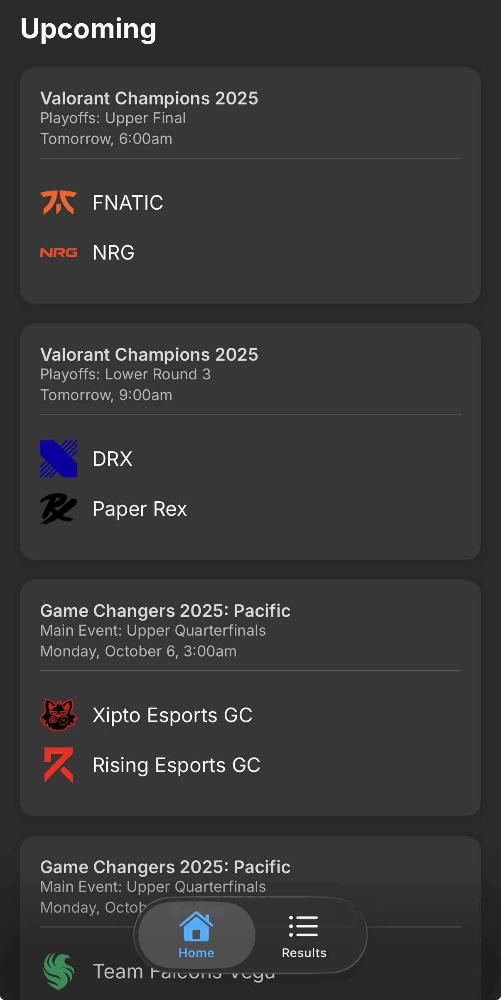
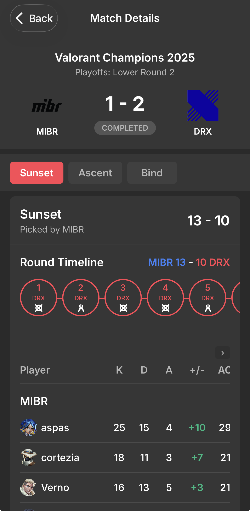

## Valorant Competitive Tracker & Live Scores

Stay on top of Valorant esports with real‑time match scores, team stats, and player highlights - all in a fast, mobile‑first experience.

See the data behind it: https://github.com/iamudyavar/vlr-scraper

### Screenshots
<table>
  <tr>
    <td align="center">
      
      
Home

    </td>
    <td align="center">
      
      
Results

    </td>
    <td align="center">
      
      
Match Details

    </td>
  </tr>
  
</table>

### What it does
- **Live scores**: See matches update in real time as rounds are played.
- **Team + player stats**: Quick access to K/D/A, ACS, map picks, and agents.
- **Search**: Powerful search features to find the match you're looking for.

### Getting started
1. Install dependencies: `npm install`
2. Add a .env file with the URL to your Convex deployment - EXPO_PUBLIC_CONVEX_URL
2. Start the app: `npx expo start`
3. Run on device or emulator via Expo Dev Tools (iOS Simulator / Android Emulator / Expo Go).

### Tech
- **Expo / React Native** for the mobile UI
- **Convex** backend for data and live updates

### Project structure (mobile)
- `app/` – routes, screens, and navigation
- `components/` – reusable UI (e.g., match cards, loading states)
- `providers/` – app‑level context (network, Convex client)
- `hooks/` – data fetching and network‑aware queries

### Notes
- Live data is rendered continuously so you can track scores and stats as they happen - no need for refreshing the page.
- Enjoy beautiful liquid glass components on iOS 26 and above
